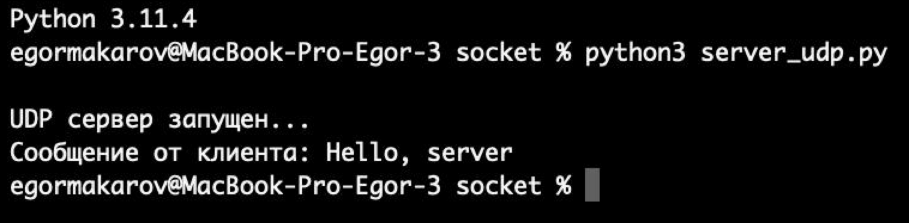
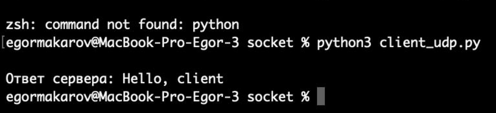
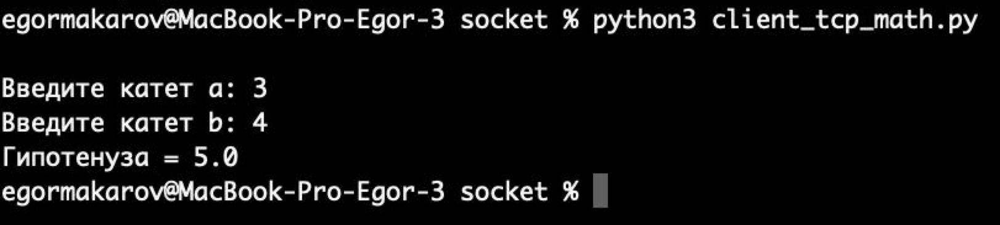
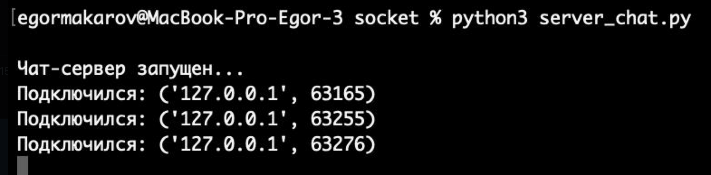
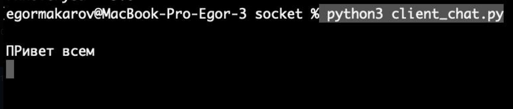
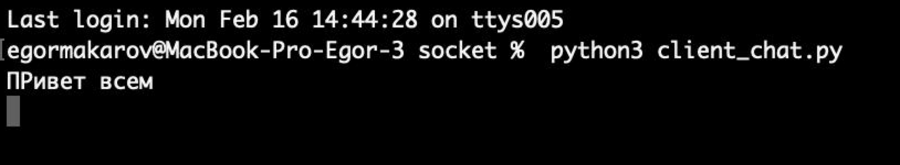
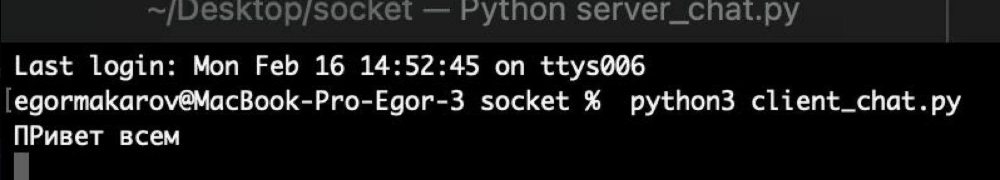
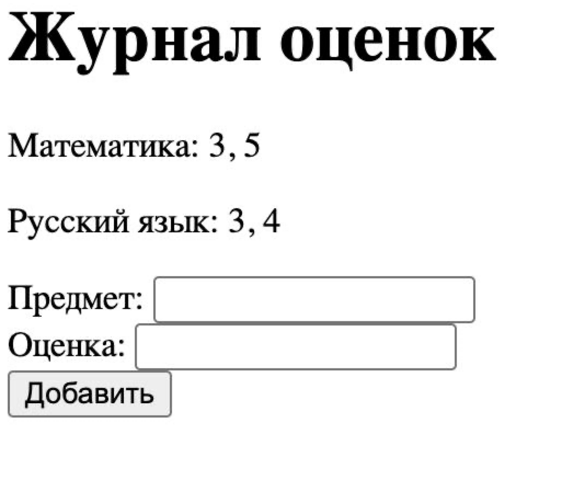

# Отчёт по лабораторной работе №1

## Работа с сокетами в Python

**Студент:** Макаров Егор
**Группа:** K3340

# Цель работы

Изучить основы клиент-серверного взаимодействия с использованием библиотеки `socket` языка Python,
а также реализовать сетевые приложения на основе протоколов **UDP**, **TCP** и **HTTP**.

# Задание 1 — UDP клиент-сервер

В рамках задания реализовано взаимодействие клиента и сервера по протоколу **UDP**.
Клиент отправляет серверу сообщение *«Hello, server»*, сервер принимает его и отправляет ответ
*«Hello, client»*, который отображается на стороне клиента.

Протокол UDP используется как быстрый протокол без установления соединения.

**Результат:** обмен сообщениями между клиентом и сервером выполнен корректно.

# Задание 2 — TCP сервер математических вычислений

Разработано клиент-серверное приложение на основе протокола **TCP**, обеспечивающего
надёжную передачу данных и установление соединения.

Сервер поддерживает выполнение следующих операций:

* вычисление гипотенузы по теореме Пифагора
* решение квадратного уравнения
* вычисление площади трапеции
* вычисление площади параллелограмма

Клиент передаёт команду с параметрами, сервер выполняет вычисление
и отправляет результат обратно.

**Результат:** все математические операции обрабатываются корректно,
ответ сервера успешно возвращается клиенту.

# Задание 3 — HTTP-сервер

Реализован простой HTTP-сервер с использованием библиотеки `socket`
без применения сторонних веб-фреймворков.

Сервер принимает HTTP-запрос от браузера и возвращает HTML-страницу
из файла `index.html`.

**Результат:** при переходе по адресу
`http://127.0.0.1:8080`
в браузере корректно отображается HTML-страница.

# Задание 4 — Многопользовательский чат

Создан многопользовательский чат на основе протокола **TCP**
с использованием библиотеки `threading`.

Особенности реализации:

* сервер принимает подключения нескольких клиентов
* для каждого клиента создаётся отдельный поток
* сообщения одного пользователя пересылаются всем участникам чата
* обеспечена одновременная работа нескольких клиентов

**Результат:** пользователи успешно обмениваются сообщениями
в режиме реального времени.

# Задание 5 — Веб-журнал оценок

Разработан простой веб-сервер для обработки HTTP-запросов
методов **GET** и **POST**.

Функциональность приложения:

* добавление дисциплины и оценки через HTML-форму
* хранение оценок списком для каждой дисциплины
* отображение всех дисциплин и оценок на веб-странице

**Результат:** несколько оценок по одной дисциплине
выводятся в одной строке в виде списка.

# Вывод

В ходе выполнения лабораторной работы были изучены
основы сетевого взаимодействия в Python:

* работа протоколов UDP и TCP
* принципы работы HTTP
* реализация многопоточных серверов
* обработка GET- и POST-запросов

Получены практические навыки разработки клиент-серверных
приложений без использования сторонних веб-фреймворков.
